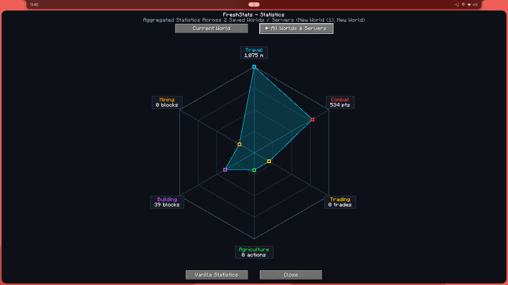
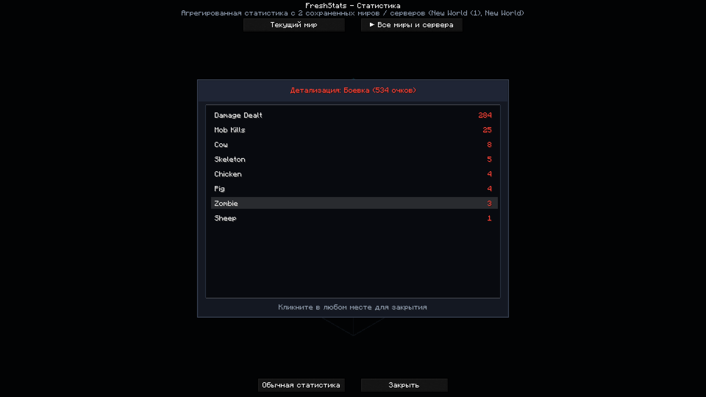
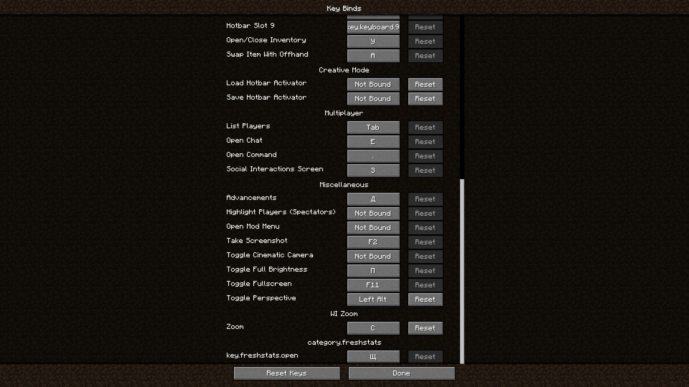

# 📊 FreshStats

[](https://minecraft.net)
[](https://fabricmc.net)
[](LICENSE)

*Read this in other languages: [English](#-english) | [Русский](#-русский)*

---

## 🇷🇺 Русский

**FreshStats** — это красивый и современный клиентский мод для Minecraft, добавляющий элегантную интерактивную диаграмму-радар для визуализации вашей игровой статистики.



### ✨ Основные возможности

- 📊 **6-осевая диаграмма-радар**: Наглядный анализ статистики по 6 категориям:
  - 🚶 **Путешествия** (дистанция пешком, бег, полет на элитрах, лодки, лошади и др.)
  - ⚔️ **Боевка** (нанесенный и полученный урон, убийства мобов по видам, убийства игроков, смертей)
  - 🤝 **Торговля** (количество успешных сделок с жителями)
  - 🌾 **Сельское хозяйство** (выращенные животные, пойманная рыба, собранный урожай)
  - 🧱 **Строительство** (количество и виды установленных строительных блоков)
  - ⛏️ **Шахтерство** (добытые блоки и руды)
- 🌐 **Глобальная агрегация миров**: Мод автоматически сканирует все сохранения в папке `saves/` и сервера, суммируя статистику со всех ваших миров!
- 🔍 **Интерактивные детали**: Клик по любой точке диаграммы открывает стильное модальное окно с детальным списком достижений и иконками предметов.
- 🎨 **Плавная анимация**: Открытие экрана сопровождается анимацией распускания диаграммы (`Cubic Ease-Out`).
- ⌨️ **Удобные горячие клавиши**: Нажмите клавишу **O** в игре для быстрой открытии статистики.



---

### 📥 Установка

1. Скачайте нужную версию из раздела [Releases](../../releases):
   - `freshstats-1.20.1-fabric.jar` (для Fabric 1.20.1)
   - `freshstats-1.21.1-26.x-fabric.jar` (для Fabric 1.21.1+)
   - `freshstats-1.20.1-neoforge.jar` (для NeoForge 1.20.1)
   - `freshstats-1.21.1-26.x-neoforge.jar` (для NeoForge 1.21.1+)
2. Поместите скачанный `.jar` файл в папку `mods/` вашего лаунчера.
3. Запустите игру и нажмите клавишу **O**!

---

## 🇬🇧 English

**FreshStats** is a clean, modern client-side Minecraft mod that introduces a sleek interactive radar chart GUI to visualize all your gameplay statistics.


### ✨ Features

- 📊 **6-Axis Hexagonal Radar Chart**: Visually analyze stats across 6 curated categories:
  - 🚶 **Travel** (walking, sprinting, elytra flight, boats, horses, etc.)
  - ⚔️ **Combat** (damage dealt/taken, entity kills breakdown, player kills, deaths)
  - 🤝 **Trading** (villager trade counts)
  - 🌾 **Agriculture** (animals bred, fish caught, harvested crops)
  - 🧱 **Building** (placed blocks breakdown)
  - ⛏️ **Mining** (mined blocks and ores breakdown)
- 🌐 **Automatic World Aggregation**: FreshStats scans all singleplayer saves in your `saves/` folder and server entries, automatically merging stats across your entire play history!
- 🔍 **Interactive Detail Modals**: Click on any point to open a solid modal window with scrollable detail lists.
- 🎨 **Smooth Spring Opening Animation**: Modern cubic ease-out animation on screen open.
- ⌨️ **Customizable Keybind**: Press **O** in-game to toggle the visual statistics GUI.



---

### 📥 Installation

1. Download the required jar from [Releases](../../releases):
   - `freshstats-1.20.1-fabric.jar` (Fabric 1.20.1)
   - `freshstats-1.21.1-26.x-fabric.jar` (Fabric 1.21.1+)
   - `freshstats-1.20.1-neoforge.jar` (NeoForge 1.20.1)
   - `freshstats-1.21.1-26.x-neoforge.jar` (NeoForge 1.21.1+)
2. Put the `.jar` file into your `.minecraft/mods` directory.
3. Launch Minecraft and press **O**!

---

## 🛠️ Building from Source

```bash
# Clone the repository
git clone https://github.com/Rom4ik-12/FreshStats.git
cd FreshStats

# Build the mod
./gradlew build
```

Built artifacts will be generated in `build/libs/` and `builds/`.

---

## 📄 License

This project is licensed under the [MIT License](LICENSE).
